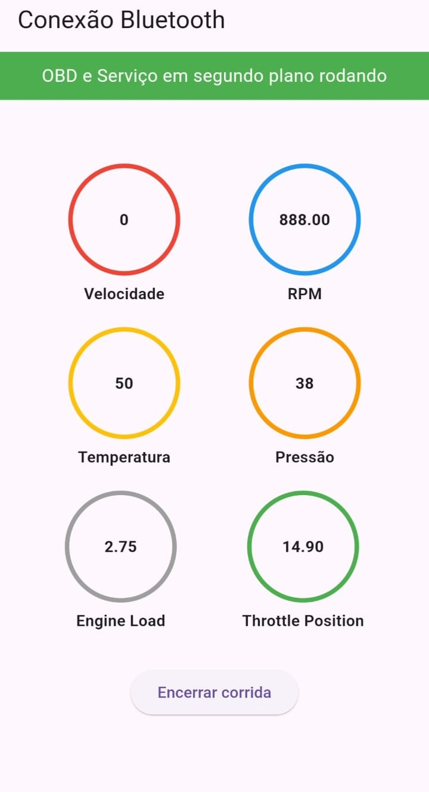
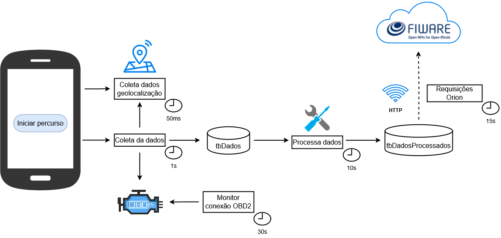
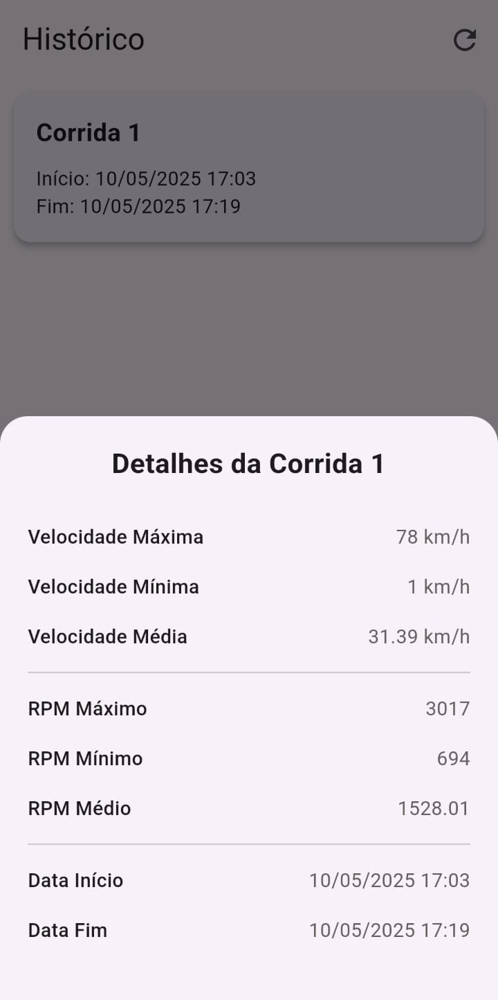

# 🚗 DriveTrack

O **DriveTrack** é um aplicativo desenvolvido em Flutter que tem como principal função a coleta de dados veiculares, para análise de comportamentos de condução. Se conectando a sensores OBD2 conectados via Bluetooth, o app registra as informações de velocidade do veículo, velocidade do motor, pressão do coletor de admissão, temperatura do ar de admissão, carga do motor e posição do acelerador. Simultaneamente, sensores do smartphone capturam dados de aceleração, giroscópio e geolocalização. Todas as informações são organizadas em estruturas de dados locais e enviadas periodicamente para a plataforma FIWARE, durante uma corrida.

## ✅ Funcionalidades

- Coleta de dados de um veículo a partir de um dispositivo ELM327
- Coleta de dados de giroscópio, acelerômetro e GPS a partir do smartphone
- Armazenamento local de dados utilizando o Hive
- Envio dos dados a uma instância do FIWARE
- Tela de histórico de corridas
- Tela de configuração do dispositivo

## 🛠 Tecnologias utilizadas
- Flutter v3.24.0
- Dart v3.5.0
- Hive v2.2.3
- flutter_blue_classic v0.0.3
- geolocator v9.0.2
- flutter_sensors v1.0.0

## 🧱 Arquitetura do Aplicativo
A arquitetura foi estruturada em três camadas principais: `business`, `domain` e `presentation`, promovendo a separação de responsabilidades.

### Business
Responsável pela lógica de negócio, comunicação com o banco de dados, serviços e APIs externas. Subdividida em:
- **Controllers**: gerenciam a lógica de negócio e interagem com os services.
- **Services**: fazem a comunicação com o banco e APIs, acessadas apenas via controller.
- **Utils**: códigos auxiliares reutilizáveis em toda a aplicação.

### Domain
Define os modelos de dados utilizados pelo app, subdivididos em:
- **Entities**: classes persistidas com Hive.
- **TOs (Transfer Objects)**: modelos temporários usados para operações como montagem de JSON para APIs.

### Presentation
Contém o código da interface gráfica: telas, widgets e interações com o usuário.

O aplicativo é composto por três áreas principais: coleta de dados, histórico de corridas e configuração do dispositivo OBD2.

### Tela de Coleta de Dados

A tela de coleta de dados é composta por um botão principal para iniciar uma corrida e encerrar a corrida. Ao iniciar a corrida, serviços em segundo plano são iniciados e buscam os dados de um dispositivo OBD escolhido pelo usuário. Além disso, durante a corrida, são o aplicativo ainda mostra as informações de velocidade, rotação do motor (RPM)            pressão do coletor de admissão, temperatura do ar de admissão, carga calculada do motor, posição do acelerador.

### Serviços da coleta de dados
O sistema é composto por cinco serviços que rodam em paralelo e são acionados por **canais de método** entre Flutter (Dart) e Kotlin (Android). A imagem abaixo apresenta um desenho para os serviços mencionados.

#### 1. Coleta via Bluetooth
A cada **1 segundo**, o app envia comandos via `flutter_blue_classic` ao ELM327, salvando:
- Resposta bruta (hexadecimal)
- Geolocalização
- Eixos do acelerômetro e giroscópio

#### 2. Coleta de Sensores e GPS
Executado a cada **50ms**, captura:
- Localização via `geolocator`
- Eixos via `flutter_sensors`

#### 3. Processamento das Respostas
A cada **10 segundos**, um serviço processa as respostas do ELM327:
- Converte valores hexadecimais conforme a documentação
- Armazena os valores convertidos em uma nova tabela
- Remove os dados brutos

##### Comandos OBD Utilizados
| Comando | Descrição                              | Resposta     | Conversão                 | Unidade |
|---------|-------------------------------------------|--------------|----------------------------|---------|
| 01 0D   | Velocidade do veículo                   | 41 0D AA     | `AA`                       | km/h    |
| 01 0C   | Rotação do motor (RPM)                 | 41 0C AA BB  | `(256 × AA + BB) / 4`      | rpm     |
| 01 0B   | Pressão do coletor de admissão         | 41 0B AA     | `AA - 40`                  | kPa     |
| 01 0F   | Temperatura do ar de admissão           | 41 0F AA     | `AA - 40`                  | °C     |
| 01 04   | Carga calculada do motor                 | 41 04 AA     | `(100 × AA) / 255`         | %       |
| 01 11   | Posição do acelerador                  | 41 11 AA     | `(100 × AA) / 255`         | %       |

#### 4. Envio para o FIWARE
A cada **15 segundos**, o app:
- Monta um JSON com os dados convertidos
- Usa o ID do veículo para formar o endpoint
- Envia via HTTP ao Orion Context Broker
- Se offline, salva localmente para reenvio posterior

#### 5. Verificação do ELM327
A cada **30 segundos**, o sistema verifica se o ELM327 parou de responder. Se sim:
- Reestabelece conexão automaticamente usando o MAC address salvo
- Mantém os demais serviços funcionando normalmente

### 🏁 Finalização da Corrida
Ao encerrar uma corrida:
- Todos os serviços são finalizados
- Dados pendentes são sincronizados com o FIWARE
- Cada corrida recebe um identificador único
- Se offline, os dados serão enviados quando o app for reaberto

### Tela de histórico de corridas

Exibe todas as corridas realizadas pelo usuário. Cada corrida é apresentada em um card contendo:
- ID da corrida
- Data de início e fim

Ao selecionar uma corrida, são exibidos os seguintes dados:
- Velocidade média, máxima e mínima
- RPM médio, máximo e mínimo

Os dados são recuperados através de uma Web API, que consulta o STH-Comet e retorna as informações em formato JSON

## 👨‍💻 Desenvolvedores
- Gabriel Gutierri da Costa
- Gabriel Foramilio Araujo
- José Honório Junior
- Vinícius Afonso dos Santos
